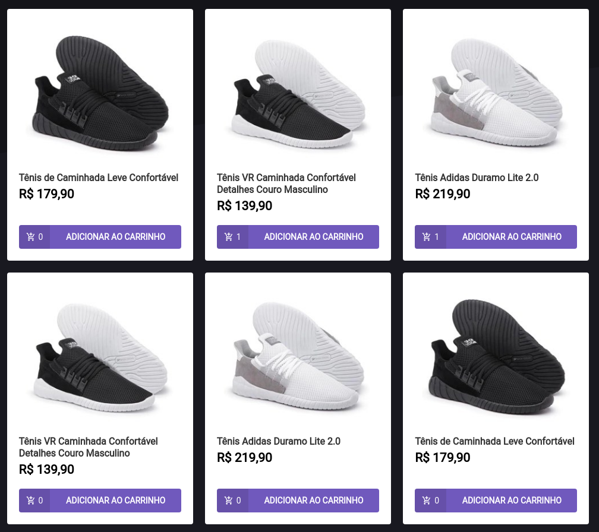
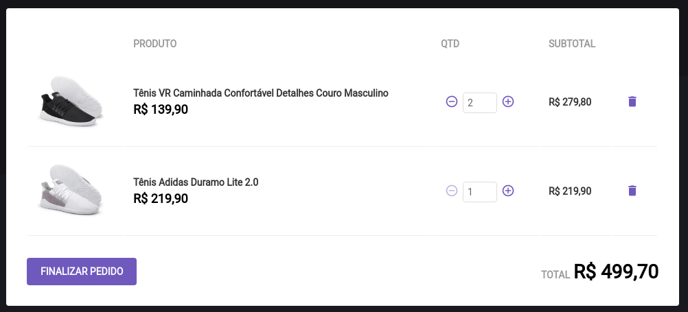

<p align="center">
  
</p>

<p align="center">
  <a href="#-tecnologias">Tecnologias</a>&nbsp;&nbsp;&nbsp;|&nbsp;&nbsp;&nbsp;
  <a href="#-projeto">Projeto</a>&nbsp;&nbsp;&nbsp;|&nbsp;&nbsp;&nbsp;
    <a href="#-como-executar">Como executar</a>&nbsp;&nbsp;&nbsp;|&nbsp;&nbsp;&nbsp;

</p>

<p align="center">


</p>
<br/>
<br/>

## 🚀 Tecnologias

Esse projeto foi desenvolvido com as seguintes tecnologias:

- HTML
- CSS
- JavaScript
- Typescript
- Reactjs
- Json-server
- Styled-components
- Axios

## 🚀 Como executar

Clone o projeto e acesse a pasta do mesmo.

```bash
$ git clone https://github.com/Hugovarellaa/desafio
$ cd desafio
```

Para iniciá-lo, siga os passos abaixo:
```bash
# Instalar as dependências
$ yarn

# Iniciar o projeto
$ yarn server
$ yarn start
```
O app estará disponível no seu browser pelo endereço http://localhost:3000.
 <br>
 <br>


## 💻 Projeto
Chapter II - Rocketseat (Desafio: Criando um hook de carrinho de compras)


